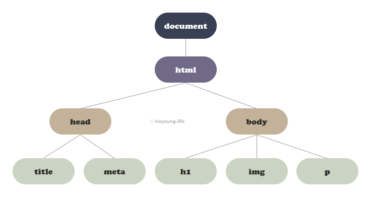
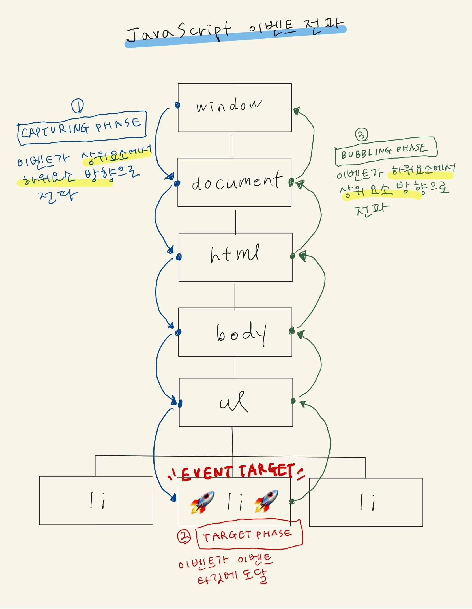
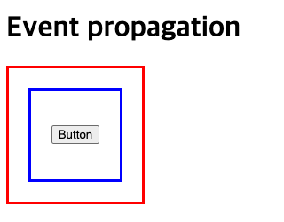
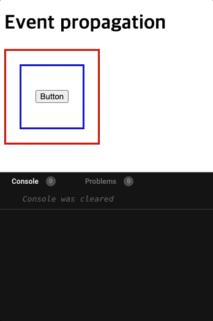
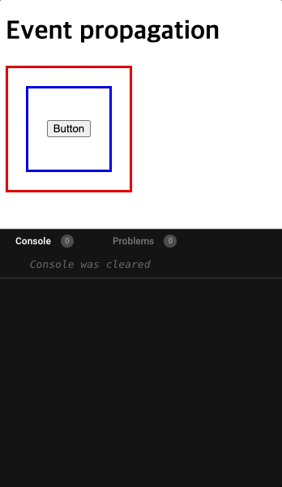
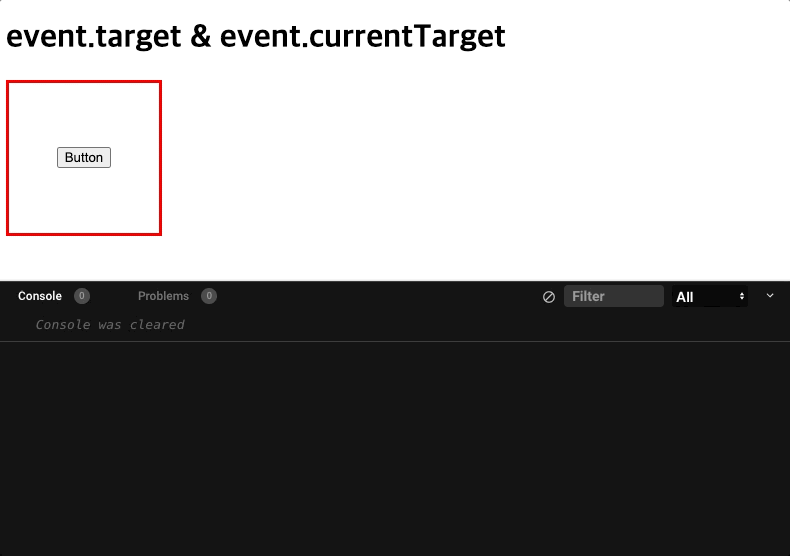
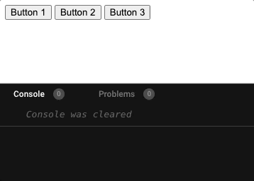
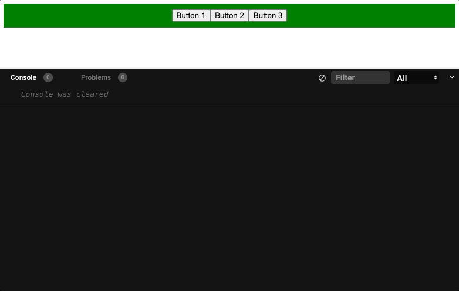
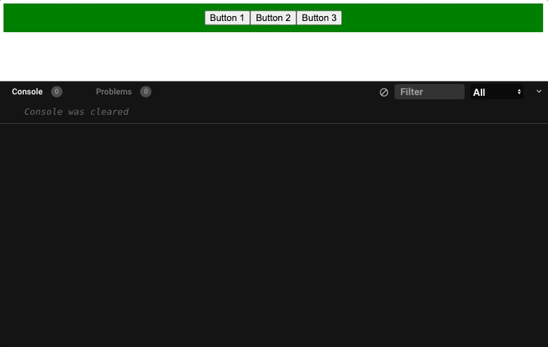

이벤트가 발생하면 이벤트에 대한 다양한 정보를 담고 있는 `event` 객체가 생성되고, 생성된 `event` 객체는 이벤트 핸들러의 첫 번째 인수로 전달된다. `event` 객체 내부에는 [다양한 프로퍼티](https://developer.mozilla.org/en-US/docs/Web/API/Event#properties)들이 존재하지만, 그 중 단연 자주 사용하는 프로퍼티를 말해보자면 `event.target`이 아닐까 싶다.

우연히 `event.target`과 `event.currentTarget`의 차이에 대해 조사를 하게 되었는데, 이 과정에서 이벤트가 어떤 방식으로 이벤트 타깃에 전달되는지에 대한 이해가 부족하다는 것을 깨달았다.

이번 기회에 JavaScript의 이벤트 전파, 이벤트 캡쳐링, 이벤트 버블링, 그리고 이벤트 위임에 대해 조사해보았고, 그 내용에 대해 정리해본다.

## DOM (Document Object Model)


_DOM Tree_

```html
<!DOCTYPE html>
<html lang="ko">
  <head>
    <meta charset="UTF-8" />
    <title>Title</title>
  </head>
  <body>
    <h1>Welcome</h1>
    
    <p>Hello World!</p>
  </body>
</html>
```

간단하게 DOM에 대해 짚고 넘어가보자.

**DOM(Document Object Model)** 이란, 브라우저에 마크업된 HTML 문서의 객체 기반 표현 방식이다. DOM은 기본적으로 **트리 계층 구조**를 가진다. 부모가 없는 최상위 node인 **root node**부터 시작해, root node의 하위 node인 **부모 node**가 존재한다. 또한 부모 node는 **자식 node**를 가지며, 자식 node가 없는 node를 **leaf node**를 가진다.

> - **Root node**: `document` 객체가 해당된다. `document` 객체는 HTML 코드 상에는 존재하지 않지만, DOM 트리의 최상위에 존재하며 브라우저가 렌더링한 HTML 문서 전체를 가리키는 객체이다.
> - **부모 node**: `<html>`
> - **자식 node**: `<head>`, `<body>`
> - **Leaf node**: `<title>`, `<meta>`, `<h1>`, `` ,`<p>`. (자식 node가 존재하지 않음)

이렇게 DOM은, root node로부터 leaf node까지 **위에서 아래로** 점점 뻗어나가는 형태로 이루어져있다.

## 이벤트 전파 (Event propagation)


_이벤트 전파 (Event propagation)_

(글씨가 삐뚤빼뚤한 점 양해바랍니다🙇‍♀️)

DOM 트리 내에 존재하는 요소에서 이벤트가 발생하면, DOM 트리를 통해 이벤트 객체가 전파된다. 이것을 **이벤트 전파 (Event propagation)** 라고 한다.

이벤트 전파는 **이벤트 객체가 전파되는 방향에 따라 3단계**로 나뉜다.

> 1. **캡쳐링 단계 (Capturing Phase)**: 이벤트가 **상위 요소 → 하위 요소 방향**으로 전파
> 2. **타깃 단계 (Target Phase)**: 이벤트가 이벤트 타깃에 도달
> 3. **버블링 단계 (Bubbling Phase)**: 이벤트가 **하위 요소 → 상위 요소 방향**으로 전파

✅ 이벤트 전파의 단계는 **`event.eventPhase`** 로 확인할 수 있다!

아래의 코드를 살펴보며, 이벤트 전파가 발생하는 장면을 실제로 경험해보자.

[CodeSandBox에서 코드를 라이브로 체험해보기 🔍](https://codesandbox.io/s/event-propagation-6rodn)

```html
<div class="redBox">
  <div class="blueBox">
    <button class="button">Button</button>
  </div>
</div>
```

`.redBox`는 가장 상위의 부모 요소, `.blueBox`는 `.redBox`의 자식 요소이며, `.button`은 `.blueBox`의 자식 요소이자, `.redBox`의 손자 요소이다.

```css
.redBox {
  display: flex;
  justify-content: center;
  align-items: center;
  width: 150px;
  height: 150px;
  border: 3px solid red;
  background-color: white;
}

.blueBox {
  display: flex;
  justify-content: center;
  align-items: center;
  width: 100px;
  height: 100px;
  border: 3px solid blue;
  background-color: white;
}

.btn {
  border: 2px solid black;
  border-radius: 5px;
}
```



각각의 요소에는 영역을 명확히 표시하고자, border를 설정해둔 상태이다.

```javascript
const redBox = document.querySelector(".redBox");
const blueBox = document.querySelector(".blueBox");
const button = document.querySelector(".button");
const phases = ["Capturing", "Target", "Bubbling"];

function handleRedBox(event) {
  console.log("Red Box Clicked");
  console.log("Red Box 이벤트 단계:", phases[event.eventPhase - 1]);
  this.style.backgroundColor = "red";
}

function handleBlueBox(event) {
  console.log("Blue Box Clicked");
  console.log("Blue Box 이벤트 단계:", phases[event.eventPhase - 1]);
  this.style.backgroundColor = "blue";
}

function handlebutton(event) {
  console.log("Btn Clicked!");
  console.log("Button 이벤트 단계:", phases[event.eventPhase - 1]);
  this.style.backgroundColor = "black";
  this.style.color = "white";
}

redBox.addEventListener("click", handleRedBox);
blueBox.addEventListener("click", handleBlueBox);
button.addEventListener("click", handlebutton);
```

이번에는 JavaScript 코드를 살펴보자. 각 Box들과 버튼을 `querySelector`를 이용하여 취득했고, 각 요소에 click 이벤트를 설정해두었다.

`.redBox`가 클릭되면 해당 요소의 배경색을 빨간색으로, `.blueBox`가 클릭되면 해당 요소의 배경색을 파란색으로, `.button`이 클릭되면 해당 요소의 배경색을 검정색으로 변경하는 간단한 코드이다.

또한, 각 요소가 클릭되었다는 것을 보다 명확히 캐치하기 위해 콘솔로 메시지를 띄우고 있다. 위의 이벤트 전파 단계에서 짧게 언급했던 `Event.eventPhase`를 이용해 현재 클릭된 요소의 이벤트 전파 단계를 출력한다.

### 이벤트 전파의 Capturing 단계와 Target 단계

[CodeSandBox에서 코드를 라이브로 체험해보기 🔍](https://codesandbox.io/s/event-propagation-6rodn)

이 상태에서 먼저 가장 상위 부모 요소인 `.redBox`를 클릭해보자.



`.redBox`를 클릭하니 `.redBox`의 배경색이 빨간색으로 바뀌었다.

위의 이벤트 타깃 일러스트를 떠올리며, 이벤트 전파 단계를 다시 한 번 살펴보자.

`.redBox`를 클릭했기 때문에, **`.redBox`가 이벤트 타깃**이 되었다. 클릭 이벤트가 발생한 후, 최상위 요소인 `window`에 클릭 이벤트 객체가 생성되었다. **클릭 이벤트 객체는 `window`에서 시작해서 `html`, `body` 등을 거쳐, 이벤트가 발생된 이벤트 타깃까지 하위 방향로 이동**한다. 이것이 바로 **`Capturing 단계`** 이다.

**클릭 이벤트 객체가 이벤트 타깃인 `.redBox`에 도달**한다. 이것이 **`Target 단계`** 이다.

위의 콘솔을 보면, `redBox`의 이벤트 단계로 `Target`이 출력된 것을 알 수 있다.

> ⚠️ 참고로, **Capturing 단계를 캐치**하기 위해서는, **캐치 하고자 하는 요소의 `addEventListener`의 세 번째 인자로 `true`를 전달**해주어야 한다. 해당 코드에는 세 번째 인자로 `true`를 전달해주지 않았으며 `.redBox`는 이벤트 타깃이기 때문에, 바로 Target 단계만 캐치된 모습이다.

### 이벤트 전파의 Bubbling 단계

이번에는 `.blueBox`를 클릭해보자. 파란색 테두리를 포함한 그 내부 영역이 `.blueBox`이다.


신기한 일이 벌어졌다. `.blueBox`만을 클릭했을 뿐인데, 그 부모 요소인 `.redBox`에도 클릭 이벤트가 감지되어 `.redBox`의 배경색이 함께 변경되었다. 왜 이런 현상이 발생하는 것일까? 그 이유는 이벤트 전파의 Bubbling 단계를 거쳤기 때문이다.

특정 요소에서 이벤트가 발생했을 때, 최상위 요소인 `window`에서 생성된 이벤트 객체는 Capturing 단계와 Target 단계를 거쳐 이벤트 타깃으로 이동하게 된다. 하지만 이벤트 타깃에 도달했다고 해서 이벤트가 종료되는 것이 아니다🙅🏻‍♀️

다시 한 번 위에서 언급된 이벤트 전파의 3단계를 살펴보자.

**이벤트 객체는 이벤트 타깃에 도달한 후에 최상위 요소인 `window`으로 상위를 향해 다시 이동**한다. 이것이 바로 **이벤트 전파의 마지막 단계인 `Bubbling 단계`** 이다.

이번에는 `.button`을 클릭해보자.


역시 `.button`의 부모인 `.blueBox`와 grand-parents인 `.redBox`까지 이벤트가 감지되었다. 콘솔을 살펴보면, `.button` → `.blueBox` → `.redBox` 순으로 이벤트가 감지된 것을 알 수 있다.

> ⚠️ 현재 콘솔에 Capturing 단계는 출력되지 않았는데, 위에서 언급한 바와 같이 Capturing 단계를 캐치하기 위해서는 `addEventListener`의 세 번째 인자에 `true`를 전달해줘야 한다. 현재의 코드는 Bubbling 단계를 관찰하기 위해, 세 번째 인자에 `true`를 전달하지 않은 상태이기 때문이다. [CodeSandBox](https://codesandbox.io/s/event-propagation-6rodn)에서 세 번째 인자에 `true`를 전달하여 실험해보자!

(`.redBox`와 `.blueBox`의 Capturing 단계의 캐치가 생략되었고) 이벤트 타깃인 `.button`에 클릭 이벤트 객체가 도달하여 `.button`에서 Target 단계가 관찰되었다.

그리고, 최상위 요소인 `window`를 향해 DOM 트리의 역순으로 클릭 이벤트 객체가 다시 이동한다. 따라서 `.button`의 부모인 `.blueBox`에 이벤트 객체가 다시 전달되어 배경색이 변경되면서 Bubbling 단계가 관찰되었다.

마찬가지로 `.blueBox`의 부모인 `.redBox`에 이벤트 객체가 다시 전달되어 배경색이 변경되면서 Bubbling 단계가 관찰되었다.

이처럼, **이벤트는 이벤트를 발생시킨 이벤트 타깃은 물론, 상위 DOM 요소에서도 이벤트를 캐치**할 수 있다.

## 이벤트 전파 멈춰!

자식 요소를 클릭했음에도 불구하고 Bubbling으로 인해, 부모 요소에까지 이벤트가 전파되어서 신경이 쓰일 때. 이벤트 타깃에만 집중하고 싶을 때.

이런 상황에는 **`event.stopPropagation()`** 메소드를 사용하면 된다.

자식 요소들인 `.blueBox`와 `.button`을 클릭했을 때는 해당 요소의 배경색만 변경되도록 `event.stopPropagation()`을 사용해보자.

```javascript
const redBox = document.querySelector(".redBox");
const blueBox = document.querySelector(".blueBox");
const button = document.querySelector(".button");
const phases = ["Capturing", "Target", "Bubbling"];

function handleRedBox(event) {
  console.log("Red Box Clicked");
  console.log("Red Box 이벤트 단계:", phases[event.eventPhase - 1]);
  this.style.backgroundColor = "red";
}

function handleBlueBox(event) {
  event.stopPropagation(); // 추가
  console.log("Blue Box Clicked");
  console.log("Blue Box 이벤트 단계:", phases[event.eventPhase - 1]);
  this.style.backgroundColor = "blue";
}

function handlebutton(event) {
  event.stopPropagation(); // 추가
  console.log("Btn Clicked!");
  console.log("Button 이벤트 단계:", phases[event.eventPhase - 1]);
  this.style.backgroundColor = "black";
  this.style.color = "white";
}

redBox.addEventListener("click", handleRedBox);
blueBox.addEventListener("click", handleBlueBox);
button.addEventListener("click", handlebutton);
```



`event.stopPropagation()` 메소드명 그대로, 이벤트 전파가 멈추게 되어 Bubbling이 발생되지 않았다.

## event.target과 event.currentTarget의 차이

서론에서 등장했었던 `event.target`과 `event.currentTarget`의 차이에 대해 정리하고자 한다.

이 부분은 직접 동작해보는 것이 이해가 가장 빠르다. 바로 코드를 살펴보는 것을 추천한다.

[CodeSandBox에서 코드를 라이브로 체험해보기 🔍](https://codesandbox.io/s/event-target-eventcurrenttarget-094de)

```html
<div class="redBox">
  <button class="button">Button</button>
</div>
```

```css
.redBox {
  display: flex;
  justify-content: center;
  align-items: center;
  width: 150px;
  height: 150px;
  border: 3px solid red;
  background-color: white;
}

.btn {
  border: 2px solid black;
  border-radius: 5px;
}
```

```javascript
const redBox = document.querySelector(".redBox");
const phases = ["Capturing", "Target", "Bubbling"];

function handleRedBox(event) {
  console.log("Red Box Clicked");
  console.log("event.target: ", event.target);
  console.log("event.currentTarget: ", event.currentTarget);
  console.log("Red Box 이벤트 단계:", phases[event.eventPhase - 1]);
  this.style.backgroundColor = "red";
}

redBox.addEventListener("click", handleRedBox);
```

부모 요소인 `.redBox`는 자식 요소인 `.button`을 가지고 있다. `.redBox`에만 클릭 이벤트를 설정해둔 상태이며, 콘솔로 `event.target`과 `event.currentTarget`이 어느 것을 가리키는지 확인한다.

[예제 CodeSandBox](https://codesandbox.io/s/event-target-eventcurrenttarget-094de)에서 중앙의 버튼을 클릭해보자.



`.redBox`에 클릭 이벤트가 할당된 상태로 `.button`을 클릭한 결과이다.

- **event.target**: `.button`
- **event.currentTarget**: `.redBox`

즉, **`event.target`은 실제 이벤트가 발생된 요소**를, **`event.currentTarget`은 이벤트 핸들러가 실제로 할당된 요소**를 가리킨다.

| property            | 설명                        |
| ------------------- | --------------------------- |
| event.currentTarget | Event handler가 등록된 요소 |
| event.target        | 실제 이벤트가 발생된 요소   |

## 이벤트 위임 (Event delegation)

### 이벤트 위임 적용 전

이벤트 전파의 성질을 이용하여 이벤트 위임을 적용하면, 이벤트를 보다 더 경제적으로 설정할 수 있다.

**이벤트 위임 (Event delegation)** 이란, **여러 개의 하위 DOM 요소에 각각 이벤트 핸들러를 등록하는 대신, 그 부모 DOM에 이벤트 핸들러를 등록**하는 방식을 말한다.

그전에 먼저, 이벤트 위임을 적용하기 전의 코드를 살펴보자. 부모 내비게이션 내부의 모든 자식 버튼 요소에 클릭 이벤트를 등록하는 상황이다.

```html
<nav class="nav">
  <button class="button">Button 1</button>
  <button class="button">Button 2</button>
  <button class="button">Button 3</button>
</nav>
```

```javascript
const buttons = document.querySelectorAll(".button");

function handleButtons(event) {
  console.log("Button Clicked");
}

buttons.forEach(button => button.addEventListener("click", handleButtons));
```

동일한 클래스명의 `.button`을 `querySelectorAll`로 한번에 취득하고, 각각의 모든 `.button`에 클릭 이벤트를 등록하기 위해 forEach문을 사용했다.



모든 자식 요소에 클릭 이벤트가 등록되어 있는 것을 확인할 수 있다.

하지만, 위와 같은 방식이라면 만약 내비게이션의 아이템이 100개라면 100개의 이벤트 리스너를 등록해야 할 것이다. DOM 요소에 이벤트 리스너를 많이 등록하게 되면, **메모리 점유율이 늘어나게 되어 페이지 성능 저하의 원인**이 된다.

또한, 내비게이션 내부에 동적(`createElement` 등)으로 추후에 또다른 `.button` 요소가 추가되는 경우를 생각해보자. `.button`에 클릭 이벤트 리스너를 추가했던 시점에 `.button`은 두 개였다. 따라서 추가된 요소에는 이벤트 리스너가 등록되지 않았다. 추가되는 요소에는 매번 이벤트 리스너를 추가해주지 않는 이상, 이벤트가 발동하지 않게 된다. 즉, **유지 보수하기 어려운 코드**를 생산하게 된다.

이렇게 모든 자식 요소에 일일이 이벤트 리스너를 등록해주는 것은 결코 좋은 방법이 아니다. 이러한 문제를 해결할 수 있는 방법이 바로 **이벤트 위임**이다.

### 이벤트 위임 적용 후

**이벤트 위임 (Event delegation)** 이란, **여러 개의 하위 DOM 요소에 각각 이벤트 핸들러를 등록하는 대신, 그 부모 DOM에 이벤트 핸들러를 등록**하는 방식을 말한다.

이벤트 전파에서 살펴본 바와 같이, **이벤트는 이벤트 타깃은 물론 그 상위 DOM 요소에서도 캐치**한다, **Bubbling 단계**가 존재한다는 점을 떠올리자.

따라서 **상위 DOM 요소에 이벤트 등록을 위임**하면, **여러 개의 하위 DOM 요소에 이벤트 리스너를 등록할 필요가 없다**. 또한 동적으로 하위 DOM 요소가 추가되더라도, 추가된 DOM 요소에 일일이 이벤트 리스너를 등록하지 않아도 된다.

위의 코드를 이벤트 위임을 응용하여 아래와 같이 수정해보았다.

```html
<nav class="nav">
  <button class="button" data-number="1">Button 1</button>
  <button class="button" data-number="2">Button 2</button>
  <button class="button" data-number="3">Button 3</button>
</nav>
```

```css
.nav {
  display: flex;
  justify-content: center;
  align-items: center;
  padding: 10px;
  background-color: green;
}
```

```javascript
const nav = document.querySelector(".nav");

function handleClick(event) {
  console.log("Clicked");
  console.log(event.target.dataset.number);
}

nav.addEventListener("click", handleClick);
```

초록색 영역의 부모 요소인 `.nav`에 클릭 이벤트를 등록했고, 어떤 버튼이 클릭되었는지 판별하기 위해 `.button`에 각각 data 속성을 추가해주었다. 클릭 이벤트가 발생되면 `data-number`의 값이 함께 출력된다.



부모 요소인 `.nav`에 이벤트를 위임하여 등록했음에도, 이벤트 버블링으로 인해 자식 요소인 `.button`에도 클릭 이벤트가 적용되었다. `.button`의 `data-number`의 값도 정확히 프린트가 되고 있다.

하지만, 이벤트가 등록된 당사자이자, 부모 요소인 `.nav`를 클릭했을 때도 당연하게도 클릭 이벤트가 발생된다. 문제는 `.nav`에는 data 속성을 지정해주지 않았기 때문에, `data-number`의 값이 `undefined`로 출력된다는 점이다.

여기서 드러나는 **이벤트 위임의 단점**은, **이벤트가 발생된 DOM 요소가 개발자가 기대한 DOM 요소가 아닐 수도 있다**는 점이다. 따라서 **이벤트에 반응이 필요한 DOM 요소(위의 예시의 경우 `.button`)에 한정하여 이벤트 리스너가 실행되도록 이벤트 타깃을 검사할 필요**가 있다.

JavaScript 코드를 다음과 같이 수정해보았다.

```javascript
const nav = document.querySelector(".nav");

function handleClick(event) {
  const { target } = event;

  // event.target이 .nav의 자식 요소인 .button이 아니라면 함수 종료
  if (!target.matches(".nav > .button")) return;

  console.log("Clicked");
  console.log(target.dataset.number);
}

nav.addEventListener("click", handleClick);
```

해당 요소가 검사하고자 하는 selector가 맞는지 체크할 수 있는 `Element.matches()` 메소드를 이용했다.

`event.target`이 `.nav`의 자식 요소인 `.button`이 아니라면 함수 종료시킨다.

[CodeSandBox 샘플 코드 🔍](https://codesandbox.io/s/event-delegation-7usgh)



`.button`을 클릭했을 때에만 이벤트가 동작하고, `.nav`를 클릭했을 때는 이벤트가 동작하지 않게 되었다!

## 마치며

`event.target`, `event.currentTarget`으로 시작한 이벤트에 대한 궁금증이, 이벤트 전파와 이벤트 위임까지 발전되었다. 생각 외로 소소하지만 많은 내용을 담게 되어 포스팅이 꽤나 길어진 것 같다. 이벤트에 대한 큰 그림, 효율적인 이벤트 바인딩을 학습할 수 있게 된 좋은 시간이었다.

부족한 내용, 잘못된 정보가 있다면 코멘트로 지적 부탁드립니다.

## Reference

- [모던 자바스크립트 Deep Dive, 이웅모 저](https://book.naver.com/bookdb/book_detail.nhn?bid=16710547)
- [MDN | Event properties](https://developer.mozilla.org/en-US/docs/Web/API/Event#properties)
- [JavaScript のイベント伝播って？（addEventListener の第三引数についても）](https://qiita.com/irico/items/8a23071719aa28e3c032)
- [생활코딩 | JavaScript - 이벤트전파 (2/3) : 캡처링
  ](https://www.youtube.com/watch?v=etrumwIUqio)
- [생활코딩 | JavaScript - 이벤트전파 (3/3) : 버블링](https://www.youtube.com/watch?v=8TurB6yoots&t=4s)
- [MDN | Comparison of Event Targets
  ](https://developer.mozilla.org/en-US/docs/Web/API/Event/Comparison_of_Event_Targets)
- [MDN | Element.matches()](https://developer.mozilla.org/ja/docs/Web/API/Element/matches)
