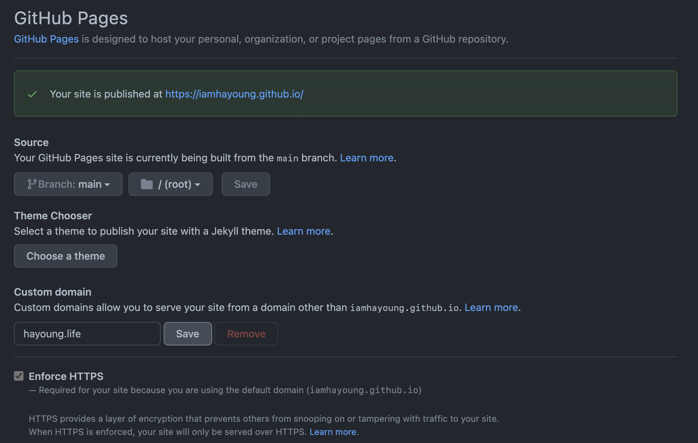

이 블로그는 **GitHub Pages**로 배포되어 있는데, GitHub Pages로 배포한 웹은 기본적으로 도메인이 [iamhayoung.github.io](https://iamhayoung.github.io)와 같은 형태로 이루어져있다.

지금 이 글을 쓰고 있는 블로그는 **앞으로 공부하면서 배운 것들을 기록해나감과 동시에, 간단한 일기장으로써 나의 생각과 생활의 일부분을 담아갈 예정**이다. 따라서, 이 블로그만큼은 **의미를 함축한, 간편한 도메인**으로 설정하고 싶었다.

결과적으로 현재 이 블로그의 도메인을 **[hayoung.life](https://hayoung.life)** 로 정했다. **내 생활, 삶을 담는 장소라는 의미**를 담았다😊

해당 포스팅은 이 블로그의 **도메인을 구매하고 연결하는 과정**을 기록했다.

---

# 1. 도메인 업체 고르기

커스텀 도메인을 설정하기 위해서는 먼저 도메인을 구매해야한다.
도메인을 구매하기 위해서는 내가 원하는 도메인을 제공하는 도메인 업체를 선정해야한다.

**같은 도메인을 판매하더라도 업체마다 가격도 천차만별, 제공하는 서비스도 가지각색**인데, 나는 다음의 기준을 가지고 업체를 선정했다.

> 1. 비용이 많이 비싸지 않을 것
> 2. 도메인 개인정보보호 서비스 (Whois Privacy Protection)를 무료로 제공할 것
> 3. 안심할 수 있는 고객지원서비스를 제공하는 곳
> 4. 안정적이고, 규모가 크고 인지도가 있는 업체일 것 (업체가 갑자기 사라지지 않을 것 같은 안심감을 위해..)

결과적으로, 위의 기준을 모두 만족한 [Namecheap](https://www.namecheap.com/)이라는 해외 도메인 업체를 선택했다.

Namecheap은 해외에서 꽤 인지도 있는 유명한 회사였다. (여기서 일단 큰 점수++) 그럼에도 비용도 대체적으로 저렴한 편에 속했다. 그리고 여러 블로그 후기를 찾아보니 유저 평가가 꽤 좋은 업체라 Namecheap을 선택하게 되었다!

# 2. 도메인을 고르기

커스텀 도메인을 설정하고자 한다면 어느 정도 희망하는 도메인이 있을 것이다. **희망하는 도메인이 이미 사용중인지, 비용은 어떤지, 혹시 이미 사용중이라면 다른 도메인들은 무엇 무엇이 있는지 살펴봐야한다.**

**[Namecheap](https://www.namecheap.com/) 사이트에 접속**해서 도메인을 골라보자.

아, 도메인을 둘러보기 전에 나는 먼저 회원 가입이 되어있는 상태였고, 로그인을 한 후에 둘러봤다.
장바구니에 담고 바로 구매를 할 예정이었기 때문..

Namecheap 메인 화면에 들어가면, 이렇게 도메인을 검색할 수 있는 input이 바로 나와있다. 원하는 도메인명을 검색하자.

검색을 하면, 그 도메인이 사용중인지 사용가능한지 여부를 알려준다. 뿐만 아니라, 그 외 다양한 도메인들도 추천해준다. **견적 받을 필요 없이** 비용도 바로바로 알 수 있어서 아주아주 편리하다👍

인기있는 도메인들은 비용이 비싸거나 이미 사용중인 경우가 많다는 점..🥲

그리고 이렇게 목적과 상황별에 따라 도메인을 선택할 수 있도록 세부 카테고리 기능을 제공하고 있다.

(사진 크기 주의)
구매할 도메인을 선택했다면, 장바구니에 담고 가격을 확인하자. 약간의 수수료가 발생한다.

그리고 **반드시 확인하고 넘어가야할 점**이 있다.

등록 첫 해에는 할인을 제공하는 경우가 많아 저렴한 편이지만, 사용하는 기간이 길어지는만큼 2년부터는 비용이 오른다. **`1 year registration` 드롭다운 메뉴를 클릭해서, 반드시 등록 1년 후의 가격도 확인하고 구매하자!**

아래의 `Checkout` 버튼을 클릭하면 바로 주문서 페이지로 이동된다.

# 3. 도메인 구매 및 결제하기

주문서 페이지에서는 각종 옵션을 선택할 수 있다. 도메인을 사용할 기간, 기간이 지나면 도메인 등록을 자동 갱신할 것인지, 그 외 Domain Privacy, DNS, SSL 인증서 사용 여부 등 사용할 환경에 맞춰 설정해주면 된다.

나는 Domain Privacy, 도메인 등록 자동 갱신만 선택했다.

위의 캡쳐 중간 부분에 있는 **Domain Privacy** 항목을 확인해보면 알 수 있듯이, **Namecheap의 경우 무료**로 제공해주고 있다! 일부 도메인 업체에서는 이 기능을 유료로 제공하는 경우가 있었기 때문에 마음에 드는 부분이다 후후.

**도메인 등록자인 나의 이름, 주소 등 개인정보를 보호하기 위해서는 Domain Privacy 기능은 필수.**

캡쳐에서 잘렸는데, 아래에 **SSL 인증서비스** (유료)를 사용할 것인지 선택하는 항목이 있다.
가격은 첫 해에는 약 4달러, 그 후에는 매년 10달러로 본 것 같다.

**보안을 위해 `HTTPS` 대응은 필수이므로, SSL 인증서비스를 이용하는 것을 추천**한다.
하지만 나는 **무료로 `HTTPS`를 제공해주는 GitHub Pages를 통해 정적 호스팅을 할 예정이기 때문에 선택하지 않았다!**

GitHub Pages를 이용해 호스팅할 예정이라면 SSL 인증서비스는 이용하지 않아도 될 듯.

아참, 그리고 구글에 `Namecheap coupon` 등으로 검색하면 Namecheap의 프로모 코드를 찾을 수 있다. 난 [공식 사이트에서 제공하는 프로모 코드](https://www.namecheap.com/promos/coupons/)를 적용했는데, 내가 선택한 도메인 자체가 원래 할인을 하고 있었어서 그런지 추가 할인은 적용되지 않았다.

옵션 설정, 프로모 코드 입력을 마치고 꼼꼼하게 확인을 한 뒤 `Continue` 클릭.

Namecheap 계정의 이름, 연락처 등 개인 정보를 입력하는 폼이 나온다. 입력 후, `Continue`.

그 다음은, Whois 관련 개인 정보를 입력하는 폼이 나온다. 위의 안내 문구에서 볼 수 있듯, ICANN에서 도메인 오너의 정보를 요청하고 있기 때문에 입력을 해주어야 한다고 함.

약간 스크롤을 내리면 Domain Privacy 기능을 사용할 것인지 다시 한 번 묻는다.

그리고 Namecheap 자체 기본 DNS를 사용할 것인지, 별도로 DNS 관리를 할 것인지에 대한 선택하는 옵션이 나온다. 이 설정은 도메인 구매 이후에도 DNS 변경은 가능하다고 한다.

나는 Namecheap BasicDNS을 선택하고 `Continue`.

그 다음은 결제페이지이다. 카드 정보를 입력해주자. 페이팔, 비트코인으로도 결제를 지원하는듯.

카드 정보 입력란 밑으로 스크롤을 내리면, 도메인의 유효 기간이 지나기 전에 어떤 서비스를 자동 갱신을 할 것인지 물어보고 있다. 원하는 서비스를 선택한 후 `Continue`.

결제전 최종 확인 페이지! 금액과 입력한 정보들을 확인하고 Pay Now 💳  
`Pay Now`를 선택하고 나면 바로 결제가 되어서 통장에서 빠져나간다🙊

등록된 이메일로 결제 확인 내역이 전송되니 확인하자. **[Namecheap의 대시보드](https://ap.www.namecheap.com/)에서도 구매한 도메인을 확인할 수 있고, 세부 설정**까지 할 수 있다.

# 4. 구매한 도메인에 접속해보기

다른 도메인 업체를 사용해보지 않아서 도메인 구매 후 사용하기까지 얼마나 걸리는지 잘 모르겠지만, **결제 후 단 5분 정도 후에 내가 구매한 도메인으로 접속**을 해보니 아래와 같은 화면이 나왔다.

생각보다 아주 빠르게 처리되었다. 도메인을 바로 이용할 수 있게 됐다🌼

# 5. DNS 설정하기

이제 구매한 도메인을 **GitHub Pages로 배포한 사이트에 연결**할 차례!

이 부분에 관해서는 Namecheap에서 제공하는 GitHub Pages link 공식 자료를 참고했다.

- [How do I link my domain to GitHub Pages | Namecheap](https://www.namecheap.com/support/knowledgebase/article.aspx/9645/2208/how-do-i-link-my-domain-to-github-pages/)

위의 자료를 바탕으로 설정한 순서를 짚어보자면 ↓

먼저 DNS를 설정해주어야하는데, Namecheap의 상단 메뉴 `Account > Dashboard > 구매한 도메인 옆에 있는 MANAGE 버튼 클릭 > Advanced DNS`순으로 메뉴를 이동하자.

`HOST RECORDS` 섹션에 아래의 정보를 바탕으로 DNS 레코드를 추가해주면 끝.

| Type         | Host | Value              | TTL       |
| ------------ | ---- | ------------------ | --------- |
| A Record     | @    | 185.199.108.153    | 30 min    |
| A Record     | @    | 185.199.109.153    | Automatic |
| A Record     | @    | 185.199.110.153    | Automatic |
| A Record     | @    | 185.199.111.153    | Automatic |
| CNAME Record | www  | username.github.io | 30 min    |

위의 캡쳐처럼 설정해주었다. 저장까지 잊지 않기.

# 6. GitHub Pages 설정하기

이제 마지막 단계!👏

`GitHub의 연결할 블로그 레포지토리 > Settings > Pages`로 이동해서 **Custom domain에 구매한 도메인을 입력 후, 보안을 위해 `Enforce HTTPS`를 반드시 선택하고 Save**를 클릭하자.

이렇게 바로 밑에 프로그레스 바가 등장해서 처리 중임을 알려준다.
약 5~10분 정도 기다린 후에 연결이 완료되면!

Your site is published at https://hayoung.life/!  
배포가 완료되었다. 바로 커스텀 도메인에 접속해 확인해보자 ===33

성공적으로 배포가 완료되었다!🎉

GitHub Pages 덕분에, HTTPS도 잘 적용된 모습!
