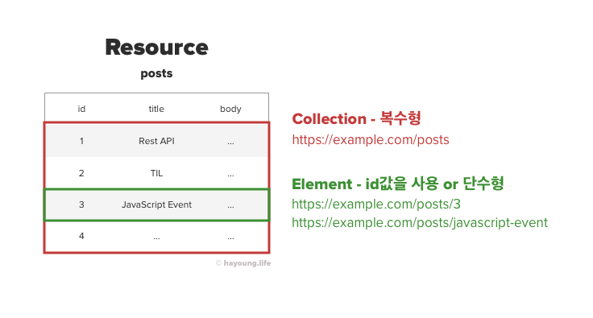

REST는 HTTP의 주요 저자인 [Roy Fielding의 2000년 박사 학위 논문](https://www.ics.uci.edu/~fielding/pubs/dissertation/rest_arch_style.htm)에서 소개된 네트워크 아키텍처 설계 지침이다.

"REST"라는 단어를 떠올리면 바로 REST API가 떠오르는데, 사실 REST는 "API"만을 설계하기 위한 지침이 아니다. 첫 문장에서 소개했듯, 네트워크에서 통신을 구성하기 위한 설계 지침이다. 훨씬 넓은 대상 범위를 가진 가이드라인이다.

REST라는 개념이 REST API로 보편화된 이유는, **현 시대의 네트워크에서 HTTP 기반의 통신이 큰 비중을 차지하기 때문**인 것 같다. HTTP 기반의 통신 환경에서 API를 개발하는 것에 있어서 REST를 준수함으로써 얻게 되는 이점이 많기 때문인 듯 하다.

그만큼 HTTP 기반의 통신 환경에서 사용되는 API의 대다수는 REST 아키텍처의 원칙을 지향 (준수)하고 있다.

> ✅ 따라서, 이 글에서는 흔히 HTTP 기반의 API 개발에서 통용되는 REST에 대해 정리해볼 생각이다. **REST의 원론적인 개념에 대해 깊은 이해가 필요하다면, REST를 제안한 [Roy Fielding의 2000년 박사 학위 논문](https://www.ics.uci.edu/~fielding/pubs/dissertation/rest_arch_style.htm)를 참고**하는 것을 추천한다.

**REST API**는 **REST 원칙을 준수하여 개발한 API**를 말한다. REST의 원칙을 성실히 지킨 아키텍처를 "RESTful하다" 라고 표현한다.

# REST?

REST는 「**RE**presentational **S**tate **T**ransfer」의 약자이다.

> - **Representational** : 구상적인
> - **State**: 상태의
> - **Transfer**: 전송 (환승)


"구상적"이라는 단어는 한국어로도 어렵다.

나는 [네이버 국어사전](https://ko.dict.naver.com/#/search?query=%EA%B5%AC%EC%83%81%EC%A0%81)에 정의된 뜻을 통해, "구상적"을 "무언가를 **인지하고 이해할 수 있도록 형태와 성질을 갖추고 있는 것**"으로 이해했다.

따라서 REST라는 단어 자체를 "**이해하기 용이한 형태로 상태가 표현된 정보 간의 교환**"으로 직역해서 이해했다. (오역이라면 지적 부탁드립니다.)

# REST의 구성 요소

REST에는 3가지의 구성 요소가 존재한다. 이 3가지의 구성 요소가 REST API 디자인의 근간을 이룬다.

> 1. **자원** (Resource) : URI
> 2. **행위** (Verb) : HTTP Method
> 3. **표현** (Representations)

## 1. 자원 (Resource) : URI

**URI(Uniform Resource Identifier)** 는 **정보의 자원을 표현**해야 한다.

URI는 **단순하고 직관적인 구조**이어야 하며, 모든 자원은 각 자원을 구별하기 위한 **Unique ID**를 가진다.

URI의 설계 디자인에 관한 자세한 내용은 후술한다.

## 2. 행위 (Verb) : HTTP Method

**자원에 대한 행위**는 HTTP 프로토콜의 Method(**GET, POST, PUT, DELETE**)으로 표현한다.

HTTP 메소드에 관한 자세한 내용은 후술한다.

## 3. 표현 (Representations)

클라이언트가 자원에 대해 요청을 하면 **서버는 이에 적절한 표현 (Representation), 즉 응답 (Response)** 을 보내야 한다.
응답 데이터는 JSON, XML, HTML 등 여러 형태로 나타낼 수 있다. 최근에는 Key, Value를 가진 형태의 **JSON**을 통해 응답 데이터를 전달받는 것이 일반적이다.

또한, **요청에 대한 응답의 Status Code를 적절하게 전달**해주어야 한다.

# REST 아키텍처의 6원칙

이론상 REST에는 6가지의 아키텍처 원칙이 있다.

> 1. **Uniform Interface** (균일한 인터페이스)
> 2. **Client-Server 구조**
> 3. **Stateless** (무상태성)
> 4. **Cacheable** (캐싱 처리 가능)
> 5. **Layered System** (계층형 시스템 구조)
> 6. **Code-On-Demand** (optional)

## 1. Uniform Interface (균일한 인터페이스)

Uniform Interface는 요청이 어디에서 오는지와 무관하게, **동일한 리소스에 대한 모든 API 요청은 동일하게 보여야 한다**는 것을 말한다.
**Uniform Interface의 4가지 제약 조건**은 다음과 같다.

### 1-1. Resource identification in requests

REST의 3요소 중 하나인 Resource (자원)는 **요청을 통해서 식별**된다. REST API에서는 자원이 **URI**로 표현되기 때문에, 각각의 **자원은 URI을 통해 식별**된다.

### 1-2. Resource manipulation through representations

Representation (표현)을 통해 자원을 조작한다. 클라이언트가 어떤 자원에 대해 표현과 메타 데이터를 충분히 갖추고 있다면, 클라이언트는 해당 자원의 상태를 수정하거나 삭제할 수 있다.

### 1-3. Self-descriptive messages

REST의 가장 중요한 원칙 중 하나로, 각 요청의 메시지 (즉 URI) 모습 자체만으로 어떤 동작이나 정보를 제공하는지 스스로를 설명할 수 있어야 한다.

### 1-4. Hypermedia as the engine of application state (HATEOAS)

하이퍼 미디어(링크)를 **애플리케이션의 상태를 전이**하기 위한 메커니즘으로 사용해야한다. 즉, 클라이언트가 서버에 어떠한 요청을 할 때, **해당 요청과 관련된 (필요한) URI를 응답에 포함시켜 반환**해야한다. 따라서 클라이언트는 최소한의 API URI만 알면, 반환되는 자원과 관련하여 처리 가능한 API URI를 모두 찾아내서 사용할 수 있다. 이러한 응답 형식을 HAL(Hypertext Application Language)라고 한다.

## 2. Client-Server 구조

> - **Client** : 자원을 Request하는 쪽. 유저 인증이나 context(세션, 쿠키, 로그인 정보) 등을 관리
> - **Server** : 자원을 Response하는 쪽. API를 제공하고 비즈니스 로직 처리를 담당

서버와 클라이언트는 각각의 역할에 따라 확실히 구분되어 있기 때문에 독립적이며 서로 간에 의존성이 적어야 한다.

## 3. Stateless (무상태성)

HTTP 프로토콜은 Stateless Protocol이므로 REST를 준수하는 REST API 역시 **무상태성**을 갖는다.

다시 말해 **클라이언트 요청과 관련된 정보를 별도로 저장하고 관리하지 않는다**. 즉, 세션이나 쿠키와 같은 상태 관리를 별도로 행하지 않기 때문에 서버는 **클라이언트를 식별하지 못한다**. 상태를 기억하지 않는다. 또한, 이전 요청이 다음 요청의 처리에 영향을 주어서는 안된다.

따라서 API 서버는 들어오는 요청만을 단순히 처리만 하면 된다. 때문에 서버에서 불필요한 상태 관리를 하지 않음으로써 **구현이 단순**해진다.

## 4. Cacheable (캐싱 처리 가능)

HTTP가 가진 가장 강력한 특징 중 하나인 캐싱을 적용할 수 있다. 오래된 데이터나 부적절한 데이터를 제공하지 못하도록 클라이언트 또는 서버 측에서 캐싱 처리를 적용할 수 있다. 캐싱을 적용하면, 응답시간이 빨라지고 REST Server 트랜잭션이 발생하지 않기 때문에 **전체 응답시간, 성능, 서버의 자원 이용률을 향상**시킬 수 있다.

## 5. Layered System (계층형 시스템 구조)

서버는 **다중 계층**으로 구성될 수 있다. 서버는 **부하 분산**을 위해 로드 밸런싱을 추가할 수도 있으며 앞단에 보안, 로드 밸런싱, 암호화, 사용자 인증 등을 추가하여 구조상의 유연성을 줄 수 있다. 또한 PROXY, 게이트웨이 같은 네트워크 기반의 중간 매체를 사용할 수 있다.

## 6. Code-On-Demand (optional)

옵션 사항이다. (반드시 충족할 필요는 없는 사항)

서버는 **클라이언트에게 Java applets나 JavaScript 코드를 전송**하여 **클라이언트 기능을 확장**할 수 있게 한다. 서버로부터 전송된 코드는 사전 구현에 필요한 기능의 수를 줄임으로써 클라이언트를 단순화한다. 서버는 코드의 형태로 클라이언트에 제공되는 기능의 일부를 제공할 수 있으며 클라이언트는 코드를 실행하기만 하면 된다.

# RESTful한 API 설계하기

와, 지금까지 정말 딱딱한 개념들을 살펴본 것 같다👀

위에 소개된 개념들을 모두 완전히 이해하지는 못하더라도, REST API를 적절하게 설계하기 위해서는 한 번쯤은 읽어보는 것을 추천한다.

결국, REST라는 개념의 포인트는

> 1. **URI는 정보의 자원을 표현**하되, URI의 형태 자체만으로 **어떤 동작이나 정보를 제공하는지 스스로를 표현**할 수 있어야 함
> 2. 자원에 대한 **행위는 HTTP Method**(GET, POST, PUT, DELETE)로 표현함
> 3. 응답 데이터는 상황에 따라 포맷이 다르지만 **JSON**이 보편적. Status Code도 반환 필수

를 관통하게 되는 것 같다.

REST 요소와 원칙, 개념을 의식하며 REST API를 설계해보자.

## URI는 정보의 자원을 표현해야 한다

다음은 자원을 구체적으로 URI로 표현하기 위한 규칙이다.

### 1. URI는 동사보다 명사를, 대문자는 사용하지 않으며 소문자만 사용한다



자원을 테이블로 표현한다면 위와 같은 형태가 된다.
자원은 `Collection`과 `Element`로 나누어 표현할 수 있다.

> - **Collection**: Element의 집합. **복수형** 명사 사용
> - **Element**: 한 건 한 건의 개별 데이터. 기본적으로 id로 식별하지만, 문자로 식별할 때는 **단수형** 명사 사용

URI에는 동사(행위)를 포함하지 않는다. 행위를 나타내기 위해서는 후술할 HTTP 메소드들을 사용한다.
따라서, 자원은 **명사로 표현**하며 대문자가 아닌 **소문자만 사용**한다. 대소문자에 따라 다른 자원으로 인식하게 되기 때문이다.

```bash
# Bad Example
/getPosts/2
```

```bash
# Good Example
/posts/2
```

단, 컨트롤 자원을 의미하는 경우에는 예외적으로 동사를 허용한다.

```bash
# Bad Example
/posts/duplicating
```

```bash
# Good Example
/posts/duplicate
```

### 2. 자원에 대한 행위는 HTTP Method로 표현한다

URI에는 동사(행위)를 포함하지 않는다. 예를 들어 아래와 같은 URI가 존재한다고 하자.

```bash
# Bad Example
/create-post/2
/get-post/2
/update-post/2
/delete-post/2
```

한눈에 보기에도 직관적이지 않고 장황하다. 이것을 지양하기 위한 REST 규칙 중 하나로 URI는 동사가 아닌 명사들로만 이루어져야 한다는 것이 있다.

그 대신, **자원에 대한 행위는 [HTTP 메소드](https://developer.mozilla.org/en-US/docs/Web/HTTP/Methods)로 표현**한다.

클라이언트가 서버에 REST API로 요청을 보낼 때는 **HTTP라는 프로토콜에 따라 요청을 전송**한다.

HTTP 통신 환경에는 여러 가지 요청 메소드들이 존재하는데, 이 메소드들은 엄밀히 특정 용도에 제한되어 있지는 않다. 아래와 같이 POST라는 메소드만으로 데이터를 읽고 쓰고 수정하고 삭제까지 가능하다.

```bash
# Bad Example
POST /post/2
POST /post/2
POST /post/2
POST /post/2
```

모두 똑같이 생겼지만, 사실은 모두 읽고 쓰고 지우고 갱신하기 위한 API이다. 이런 방식으로 URI를 설계해도 문제 없이 동작은 하겠지만, **POST라는 메소드만으로는 정확히 이 API가 어떤 처리를 행하는지 파악하기가 힘들다**. 또한, 주로 팀으로 진행되는 개발 환경에서는 **원활한 협업을 위해 팀 구성원이 모두 이해할 수 있는 형태로 프로그래밍을 하는 것이 중요**하다.

따라서, **요청을 보내는 URI만으로도 누구든지 각 요청의 의도를 쉽게 파악할 수 있도록 설계**해야한다. RESTful하게 API를 만들기 위해서는 **HTTP 메소드를 목적에 따라 구분해서 사용**해야 한다. HTTP 메소드를 알맞은 역할대로 나눈 것이 **CRUD**이다.

| Method | Action | 역할                     |
| ------ | ------ | ------------------------ |
| POST   | Create | 새로운 자원을 추가, 생성 |
| GET    | Read   | 자원을 조회, 가져옴      |
| PUT    | Update | 해당 자원의 전체를 수정  |
| PATCH  | Update | 해당 자원의 일부만 수정  |
| DELETE | Delete | 해당 자원을 삭제         |

위의 HTTP 메소드의 역할에 따라 다시 URI를 구성해보자.

#### POST

```bash
# 새로운 포스팅 생성, 추가
POST /posts/4
```

#### GET

```bash
# 모든 포스팅 조회
GET /posts

# 1번 포스팅 조회
GET /posts/1
```

#### PUT, PATCH

```bash
# PUT: 모든 포스팅 정보 수정 (작성자, 날짜, 제목, ID 등 포스팅 관련 모든 정보를 수정할 때)
PUT /posts/1

# PATCH: 포스팅의 일부 정보 수정 (날짜만 수정할 때)
PATCH /posts/1
```

#### DELETE

```bash
# 2번 포스팅 삭제
DELETE /posts/2
```

### 3. 슬래시(/)는 계층 관계를 구분하기 위해 사용

블로그 포스팅 관련 API의 URI을 구성한다고 하자. 위의 예시 일러스트에서 소개된 URI처럼 블로그의 포스팅 중 2번 포스팅의 글을 조회하는 경우에는 다음과 같이 표현한다.

```bash
GET /posts/2
```

**`/`로 계층 관계를 구분**해서 posts라는 큰 범주 내에 존재하는 2번 포스팅이라는 것을 표현하고 있다.

### 4. URI 마지막 문자로 슬래시(/)를 포함하지 않는다

바로 위 2번에서 `/`는 계층 관계를 구분하기 위해 사용하는 것이기 때문에, 마지막에는 (더이상 계층이 없기 때문에) 슬래시를 사용하지 않는다.

```bash
# Bad Example
POST /posts/2/
```

```bash
# Good Example
POST /posts/2
```

### 5. 언더 바(\_) 대신 하이픈(-) 사용

언더바 (\_)는 사용하지 않는다. 대신 **하이픈 (-)을 사용**한다.

다만 가급적 하이픈의 사용도 최소화하며, **URI 가독성을 높이기 위해 단어의 결합이 불가피한 경우**에 사용한다.

```bash
# Bad Example
GET /posts/what_is_a_rest_api
```

```bash
# Good Example
GET /posts/what-is-a-rest-api
```

### 6. URI에는 파일 확장자를 포함시키지 않는다

REST API에서는 메시지 바디 내용의 포맷을 나타내기 위한 **파일 확장자를 URI 안에 포함시키지 않는다**. 그 대신 Accept header를 사용해 Context의 타입을 전달한다.

예를 들어 `Hello,World`라는 내용을 가진 파일이 있다고 가정하자.

이 파일을 `txt`와 `csv`로 모두 제공하려면

```bash
# Bad Example
/posts/2/hello.txt
/posts/2/hello.csv
```

두 가지의 API를 준비해야하며, 서버에는 `hello.txt`, `hello.csv` 두 개의 파일로 존재할 것이다. 위의 두 URI은 분명히 다른 자원을 식별하는 URI이지만, **실제로는 하나의 자원**을 가리키고 있다. 이것은 **비효율적**인 방법이다. **자원이 하나라면 URI도 하나**여야 한다.

따라서, REST API에서는 URI에 파일 확장자를 포함시키지 않고 해당 요청이 왔을 때 Accept header를 적절히 파싱해서 클라이언트가 요청한대로 응답해주면 된다.

RESTful하게 API를 설계하면 아래와 같다.

```bash
# Good Example
GET /posts/2/hello HTTP/1.1
Host: example.com
Accept: text/plain

GET /posts/2/hello HTTP/1.1
Host: example.com
Accept: text/csv
```

### 7. 필터를 위해 쿼리 파라미터를 사용한다

자원에 대한 **세부적인 정렬, 페이징, 필터링** 등은 신규 API를 생성하지 않고 **쿼리 파라미터를 사용**한다.

```js
// 장르가 2(로맨스)이고 status가 1(상영중)인 영화 중, 3번 index부터 5개의 영화를 조회
GET /movies?genres=2&offset=1&limit=5&status=1
```

### 8. 리소스 간에는 연관 관계가 있는 경우

REST 리소스 간에는 연관 관계가 있을 수 있다. 예를 들어 유저가 로그인 중인 디바이스 목록이나 유저가 좋아하는 영화 등과 같은 관계를 말한다. `유저-디바이스` 또는 `유저-영화` 등과 같이 각각의 자원 간의 관계를 표현해야 한다.

이런 경우 REST API에서는 `/자원명/자원 ID/관계가 있는 자원명`과 같은 표현 방법으로 사용한다.

예를 들어, 유저가 로그인 중인 디바이스 목록을 표현해보면 아래와 같다.

```bash
GET /users/{userid}/devices
GET /users/hayoung/devices
```

또한, 유저가 좋아하는 영화 목록을 표현해보면 아래와 같다.

```bash
# 일반적으로 소유 ‘has’의 관계를 표현
GET /users/{userid}/likes/movies
GET /users/hayoung/likes/movies
```

## HTTP 응답 상태 코드

마지막으로 REST API는 자원에 대한 적절한 응답을 반환해주는 것까지 포함되어야 한다. 정확한 응답의 상태 코드만으로 클라이언트는 응답에 대한 상태를 빠르게 파악할 수 있으며, 요청이 정상적으로 처리가 되었는지 파악할 수 있기 때문이다.

상태 코드는 5개의 그룹으로 나누어진다.

> - **1xx** (정보) : 요청을 받았으며 프로세스를 계속 진행할 것임
> - **2xx** (성공) : 요청을 정상적으로 받았으며 응답 성공
> - **3xx** (리다이렉션) : 클라이언트는 요청 완료하기 위해 추가적인 행동을 취해야 함
> - **4xx** (클라이언트 오류) : 클라이언트의 부적절한 요청. 요청의 문법이 잘못되었거나 요청을 처리할 수 없음
> - **5xx** (서버 오류) : 서버 측의 오류 발생

세부적인 상태 코드는 [이 블로그](https://www.whatap.io/ko/blog/40/)가 자세하니 참고.

# 마치며

결국 REST API란, HTTP 요청을 보낼 때 위의 규칙들로 구성된 URI에 적절한 HTTP 메소드를 사용할 것인지에 대해 개발자들 사이에서 널리 지켜지고 있는 약속이다. REST 원칙을 기반으로 암묵적으로 통용되고 있는 형식인 것이다. 따라서 **명확한 표준이 없기 때문에**, REST에 대한 이해를 바탕으로 현재 우리 조직의 **스펙과 시스템에 맞춰서 표준화된 가이드라인을 가지고 그것을 구성원 모두가 준수하도록 노력**해야한다.

# References

- [https://gmlwjd9405.github.io/2018/09/21/rest-and-restful.html](https://gmlwjd9405.github.io/2018/09/21/rest-and-restful.html)
- [https://meetup.toast.com/posts/92](https://meetup.toast.com/posts/92)
- [https://wallees.wordpress.com/2018/04/19/rest-api-hateoas/](https://wallees.wordpress.com/2018/04/19/rest-api-hateoas/)
- [https://en.wikipedia.org/wiki/Representational_state_transfer](https://en.wikipedia.org/wiki/Representational_state_transfer)
- [https://www.youtube.com/watch?v=PmY3dWcCxXI](https://www.youtube.com/watch?v=PmY3dWcCxXI)
- [https://jaweb.tistory.com/entry/REST-RestFul%EC%9D%B4%EB%9E%80-%EB%AC%B4%EC%97%87%EC%9D%B8%EA%B0%80](https://jaweb.tistory.com/entry/REST-RestFul%EC%9D%B4%EB%9E%80-%EB%AC%B4%EC%97%87%EC%9D%B8%EA%B0%80)
- [https://developer.mozilla.org/ko/docs/Web/HTTP/Status](https://developer.mozilla.org/ko/docs/Web/HTTP/Status)
